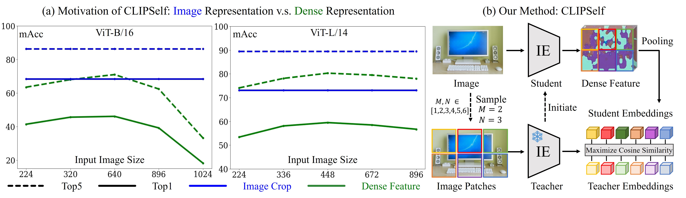

# CLIPSelf: Vision Transformer Distills Itself for Open-Vocabulary Dense Prediction

## Introduction

This is an official release of the paper **CLIPSelf: Vision Transformer Distills Itself for Open-Vocabulary Dense Prediction**.

> [**CLIPSelf: Vision Transformer Distills Itself for Open-Vocabulary Dense Prediction**](https://arxiv.org/abs/2310.01403),            
> Size Wu, Wenwei Zhang, Lumin Xu, Sheng Jin, Xiangtai Li, Wentao Liu, Chen Change Loy            
> [Bibetex](https://github.com/wusize/CLIPSelf#citation)

## TODO
- [x] Code and models of CLIPSelf
- [x] Code and models of F-ViT
- [ ] Support F-ViT under the [ovdet](https://github.com/wusize/ovdet) repo using MMDetection3.x

## Installation

This project is adapted from [OpenCLIP-v2.16.0](https://github.com/mlfoundations/open_clip/tree/v2.16.0). Run the
following command to install the package

```bash
pip install -e . -v
```

## Data Preparation
The main experiments are conducted using images from [COCO](https://cocodataset.org/#home) 
and [LVIS](https://www.lvisdataset.org/) datasets. Please prepare datasets and organize them like the 
following:


```text
CLIPSelf/
├── data
    ├── coco
        ├── annotations
            ├── instances_train2017.json  # the box annotations are not used
            ├── panoptic_val2017.json
            ├── panoptic_val2017     # panoptic masks
        ├── train2017
        ├── val2017
        ├── coco_pseudo_4764.json    # to run RegionCLIP
        ├── coco_proposals.json      # to run CLIPSelf with region proposals
    ├── lvis_v1
        ├── annotations
            ├── lvis_v1_train.json  # the box annotations are not used
        ├── train2017    # the same with coco
        ├── val2017      # the same with coco
```
For CLIPSelf with region proposals or RegionCLIP that uses region-text pairs, obtain `coco_pseudo_4764.json` or `coco_proposals.json` from [Drive](https://drive.google.com/drive/folders/11zG4nJffm0MbvA0Ph19p6jvJFj6VwRAH?usp=sharing). Put the json files under `data/coco`.

## Run
### Original Models 
To run CLIPSelf, first obtain the original models from 
[EVA-02-CLIP](https://github.com/baaivision/EVA/tree/master/EVA-CLIP), and put them under 
`checkpoints/` like the following:

```text
CLIPSelf/
├── checkpoints
    ├── EVA02_CLIP_B_psz16_s8B.pt
    ├── EVA02_CLIP_L_336_psz14_s6B.pt
    
```

### Training and Testing 
We provide the scripts to train CLIPSelf and RegionCLIP under [scripts/](scripts), they are summarized as follows:

|  #  |       Model       |   Method   | Proposals | Training Data |                                Script                                | Checkpoint |
|:---:|:-----------------:|:----------:|:---------:|:-------------:|:--------------------------------------------------------------------:|:----------:|
|  1  |     ViT-B/16      |  CLIPSelf  |     -     |     COCO      |  [script](scripts/train_clipself_coco_image_patches_eva_vitb16.sh)   | [model](https://drive.google.com/file/d/1Nz1xH7cbR8HEW40rMtYUn3PE5ypLw5vb/view?usp=sharing)  |
|  2  |     ViT-B/16      |  CLIPSelf  |     +     |     COCO      | [script](scripts/train_clipself_coco_region_proposals_eva_vitb16.sh) | [model](https://drive.google.com/file/d/1Tf8gJWmbRnsX8verC6Ee7lK3Dm781p5M/view?usp=sharing)  |
|  3  |     ViT-B/16      | RegionCLIP |     +     |     COCO      |        [script](scripts/train_regionclip_coco_eva_vitb16.sh)         | [model](https://drive.google.com/file/d/1lfaSAenNpfE1Smiv2WIdj0y4Mcb3NrP7/view?usp=sharing)  |
|  4  |     ViT-L/14      |  CLIPSelf  |     -     |     COCO      |  [script](scripts/train_clipself_coco_image_patches_eva_vitl14.sh)   | [model](https://drive.google.com/file/d/1vycKoimE2-QHjzQFCXMc4YH-tfJq-GMT/view?usp=sharing)  |
|  5  |     ViT-L/14      |  CLIPSelf  |     +     |     COCO      | [script](scripts/train_clipself_coco_region_proposals_eva_vitl14.sh) | [model](https://drive.google.com/file/d/1UQ3YpYeoXs4ESruUqrpWE4VwOD5UHp-S/view?usp=sharing)  |
|  6  |     ViT-L/14      | RegionCLIP |     +     |     COCO      |        [script](scripts/train_regionclip_coco_eva_vitl14.sh)         | [model](https://drive.google.com/file/d/1unxcWfzNQfyPj_PYtgtr8prne63l80eh/view?usp=sharing)  |
|  7  |     ViT-B/16      |  CLIPSelf  |     -     |     LVIS      |  [script](scripts/train_clipself_lvis_image_patches_eva_vitb16.sh)   | [model](https://drive.google.com/file/d/1-yfrMVaS4aN5uZSYCTalhJ_Pq3j_2aT4/view?usp=sharing)  |
|  8  |     ViT-L/14      |  CLIPSelf  |     -     |     LVIS      |  [script](scripts/train_clipself_lvis_image_patches_eva_vitl14.sh)   | [model](https://drive.google.com/file/d/1_bQMw-R0tBgvFWAAJFi7RbAHN4-OYIz0/view?usp=sharing)  |

For example, if we want to refine ViT-B/16 by CLIPSelf using only image patches on COCO, simply run:
```bash
bash scripts/train_clipself_coco_image_patches_eva_vitb16.sh    # 1
```
We also provide the checkpoints of the listed experiments above in [Drive](https://drive.google.com/drive/folders/1APWIE7M5zcymbjh5OONqXdBOxFy3Ghwm?usp=sharing). 
And they can be organized as follows:

```text
CLIPSelf/
├── checkpoints
    ├── eva_vitb16_coco_clipself_patches.pt     # 1
    ├── eva_vitb16_coco_clipself_proposals.pt   # 2
    ├── eva_vitb16_coco_regionclip.pt           # 3
    ├── eva_vitl14_coco_clipself_patches.pt     # 4
    ├── eva_vitl14_coco_clipself_proposals.pt   # 5
    ├── eva_vitl14_coco_regionclip.pt           # 6
    ├── eva_vitb16_lvis_clipself_patches.pt     # 7
    ├── eva_vitl14_lvis_clipself_patches.pt     # 8
```

To evaluate a ViT-B/16 model, run:
```bash
bash scripts/test_eva_vitb16_macc_boxes_masks.sh name_of_the_test path/to/checkpoint.pt
```
To evaluate a ViT-L/14 model, run:
```bash
bash scripts/test_eva_vitl14_macc_boxes_masks.sh name_of_the_test path/to/checkpoint.pt
```

## F-ViT
Go to the folder `CLIPSelf/F-ViT` and follow the instructions in this [README](F-ViT/README.md).

## License

This project is released under the [Apache 2.0 license](LICENSE).


## Citation

```bibtex
@article{wu2023clipself,
    title={CLIPSelf: Vision Transformer Distills Itself for Open-Vocabulary Dense Prediction},
    author={Size Wu and Wenwei Zhang and Lumin Xu and Sheng Jin and Xiangtai Li and Wentao Liu and Chen Change Loy},
    journal={arXiv preprint arXiv:2310.01403},
    year={2023}
}
```


## Acknowledgement

We thank [OpenCLIP](https://github.com/mlfoundations/open_clip/tree/v2.16.0), 
[EVA-CLIP](https://github.com/baaivision/EVA/tree/master/EVA-CLIP) and 
[MMDetection](https://github.com/open-mmlab/mmdetection/tree/v2.28.1) for their valuable code bases.
